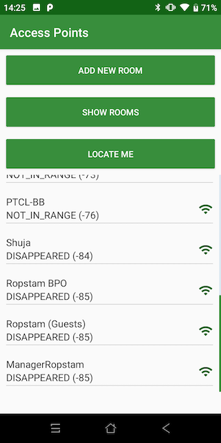
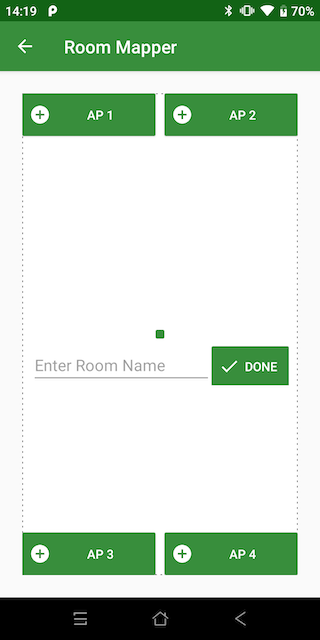
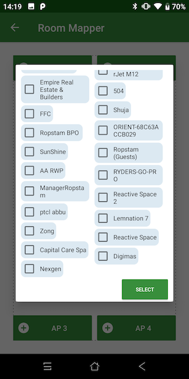
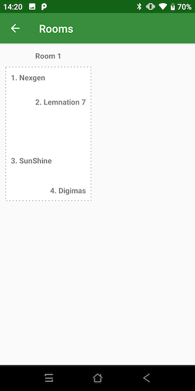

# Smart In-Door Positioning with Android
This is an In-Door Positioning with AccessPoints/Wi-Fi project with Android JetPack & AndroidX Implementation.

### Navigation + Room DAO + RxJava2 + Kotlin + Dagger2  + RecyclerView DiffUtil + RxLogs  + ViewModel + AndroidX
##### `A simple android project for tracking device's location indoor developed with latest Android Architecture components.` 

This app is designed to add information about *Rooms* & *Access Points* within the room. App will continuously scan nearby Wi-Fis & calculate device's location based on the information received by the scanner. 

*Note:* App will only start scanning & calculating indoor location once room or rooms are added in the app.

* Jetpack Navigation is used
* Written in Kotlin
* Room DAO used for Database
* Dagger2 used for dependency injection with **dagger.android** approach
* RecyclerView DiffUtil used for RecyclerView Adapter
* Android MVVM, Repository Pattern is used
* Foreground Service Implementation
* Text-to-speech Module

## How it Works?

Android OS keeps list of all detected Wi-Fi Access Points in its database and provides an API that we can integrate in our apps. Due to some limitation’s OS will not notify the app actively about Access Point changes, but we can still do a manual scan to read the status of Access Points. The important thing we need is “Access Point” name and signal strength level. Following is the table of Signal strength ranges pre-defined for Android:

| Signal Strength Range | Position Relative to Access Point |
| ------------- | ------------- |
| -32 to 0  | VERY NEAR  |
| -40 to -32  | CLOSE  |
| -55 to -40  | MIDDLE  |
| -60 to -55  | AWAY  |
| -67 to -60  | FURTHER AWAY  |
| -70 to -67  | FAR  |
| -80 to -70  | NOT IN RANGE  |
| Anything Above | DISAPPEARED  |

Every time app scans the Access Points, it saves the list in its repository and then does the calculation. The calculation depends on the access points mapping of the room. We can define the Access Points for each room and in this app, we can define 4 access points at a time. 
For now we are only considering the count of Access Points & their Signal Strength levels in the room to calculate presence of the device in the room, in later development we can use the “Room Mapper” to pin point the location of the device within in the room as we will know the location of access point in the room. 
In this app, app will continuously check rooms and their access points. If more than 3 access points within the room are in range of “VERY_CLOSE”, “CLOSE” or “MIDDLE”, then there is high probability that device is within the room.
For now, we are not considering information like room entered, exited time, adding this information into our calculation will also improve the accuracy.

### Home Screen
This screen will show list of all nearby access points and their signal strength levels. List is sorted by closest access points to the device.

### Room Mapper Screen
In this screen we can select 4 access points in the room and also set the “Room Name”. 

Here is the location mapping of Access Points from Arial View of Floor Map:

- AP 1: Top Left Corner of the Room
- AP 2: Top Right Corner of the Room
- AP 3: Bottom Left Corner of the Room
- AP 4: Bottom Right Corner of the Room

For best results to map access points, device should be kept in middle of the room and then app will display the closest access points to map on the room.

### Access Point Selection Dialog
Only single Access point can be selected at a time. Access points are sorted according to the signal strength levels.

### Rooms Screen
This screen will display list of all rooms and their floor mapping. To map accurately, we can add “Drag-Sort” functionality in this list to map realistic floor plans and also add “Hallways”.

### Locate Screen
This screen will display “Person” icon on the room which is closest according to calculation. In the screen shot, app detected the person to be in 3 rooms at a time, that is because 2 access points are common in these 3 rooms. If each room has unique access point, then accuracy will improve. 
We have also added “Text-to-Speech” functionality to test the app while it is pocket. Device will announce the room name every time it is detected.

### Flow Diagram

                
## MIT License

##### Copyright (c) 2018 Muhammad Umair Adil

Permission is hereby granted, free of charge, to any person obtaining a copy of this software and associated documentation files (the "Software"), to deal in the Software without restriction, including without limitation the rights to use, copy, modify, merge, publish, distribute, sublicense, and/or sell copies of the Software, and to permit persons to whom the Software is furnished to do so, subject to the following conditions:

The above copyright notice and this permission notice shall be included in all copies or substantial portions of the Software.

THE SOFTWARE IS PROVIDED "AS IS", WITHOUT WARRANTY OF ANY KIND, EXPRESS OR IMPLIED, INCLUDING BUT NOT LIMITED TO THE WARRANTIES OF MERCHANTABILITY, FITNESS FOR A PARTICULAR PURPOSE AND NONINFRINGEMENT. IN NO EVENT SHALL THE AUTHORS OR COPYRIGHT HOLDERS BE LIABLE FOR ANY CLAIM, DAMAGES OR OTHER LIABILITY, WHETHER IN AN ACTION OF CONTRACT, TORT OR OTHERWISE, ARISING FROM, OUT OF OR IN CONNECTION WITH THE SOFTWARE OR THE USE OR OTHER DEALINGS IN THE SOFTWARE.